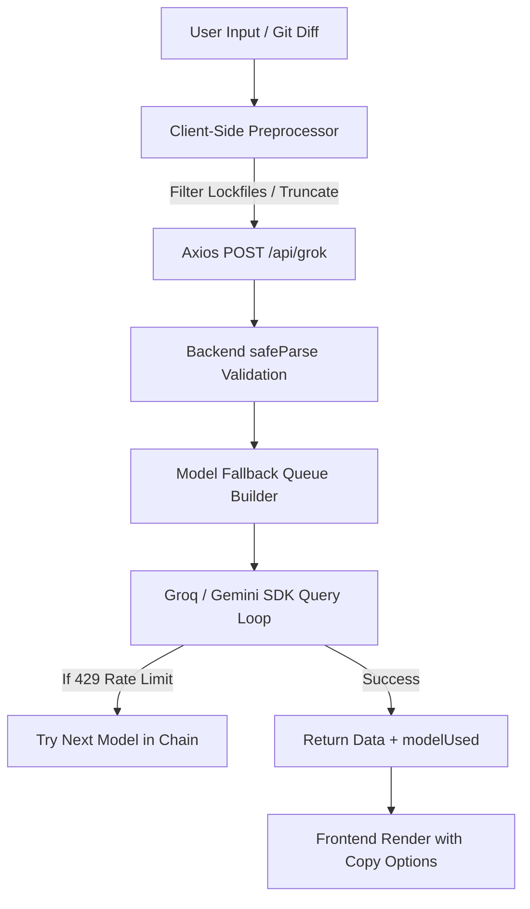

# AI System Architecture: Commit & Readme Generator Pipeline

This document provides a comprehensive overview of the design, input processing, API passing, model routing, and error-handling architecture for the **Commit Message Generator** and **Readme Generator** systems.

---

## System Overview & Data Flow

The AI pipeline is designed with a **client-heavy preprocessing and backend-heavy routing** topology. This maximizes performance, minimizes unnecessary rendering, and guarantees fallback reliability under rate-limit constraints.



---

## 1. Commit Message Generator Pipeline

The Commit Generator turns raw `git diff` outputs or plain text descriptions into standardized git semantic commit messages using a multi-model fallback queue.

### Input Preprocessing (Client-Side)
To prevent exceeding token limits and maintain rendering performance, the diff is preprocessed using a lightweight 3-line filter before the prompt is created.

* **Purpose:** Removes dependency updates (lockfiles) which make up 95% of git diff sizes but hold zero context for code logical changes.
* **Implementation:**
  ```typescript
  const preprocessDiff = (diff: string): string => {
      if (!diff) return "";
      return diff
          .split(/^diff --git /m)
          .filter(file => !file.includes("package-lock.json") && !file.includes("pnpm-lock.yaml") && !file.includes("yarn.lock"))
          .join("\ndiff --git ");
  };
  ```

> [!TIP]
> This function is wrapped in a React `useMemo` hook:
> ```typescript
> const cleanedDiff = useMemo(() => preprocessDiff(diffInput), [diffInput]);
> ```
> This prevents recalculating the array filters on every keypress as the user types, keeping the UI completely lag-free.

---

### Centralized Model Fallback Chain (Backend-Side)
The backend loads the model sequence dynamically from environment variables and builds a prioritised queue depending on input length:

1. **Fallback Chain Config (`.env.local`):**
   ```env
   GROK_MODEL_FALLBACK_CHAIN="llama-3.1-8b-instant,meta-llama/llama-4-scout-17b-16e-instruct,groq/compound-mini,groq/compound,llama-3.3-70b-versatile"
   ```
2. **Initial Target Selection:**
   * **Medium input (< 20,000 characters / ~5k tokens):** Starts with `llama-3.1-8b-instant` (Index 0) to conserve API quotas.
   * **Large input (≥ 20,000 characters):** Starts with `meta-llama/llama-4-scout-17b-16e-instruct` (Index 1) which has a generous 30K TPM window.
3. **Execution Loop:**
   If the initial model returns a `429` rate limit error, the loop automatically retries with the next model in the chain (`Compound Mini` $\rightarrow$ `Compound` $\rightarrow$ `Llama 3.3 70B`) until success:
   ```typescript
   for (const currentModel of queue) {
       try {
           const aiOutput = await groq.chat.completions.create({ ... });
           return { text: aiOutput.content, modelUsed: currentModel };
       } catch (err: any) {
           if (err.status !== 429) throw err; // Re-throw validation/syntax errors immediately
           console.warn(`429 on ${currentModel}. Retrying...`);
       }
   }
   ```

---

## 2. Readme Generator Pipeline

The Readme Generator queries the Gemini API pool to draft technical markdown readmes, routing requests dynamically based on context size.

### Gemini Routing Strategy
The system utilizes two distinct layers to prevent hallucinations on complex codebases:

* **Layer 1 (Lighter files):** Uses `gemini-3.1-flash-lite` for standard file analysis.
* **Layer 2 (Heavier / Comprehensive context):** Routes automatically to `gemma-4-26b-a4b-it` when analyzing larger files or complex frameworks.

### Client-Side Performance Optimizations
Inside `ReadmeGenerator.tsx`, React hooks are optimized to prevent redundant computations during state changes (e.g., typing custom instructions or changing project version):

* **GitHub URL Parser Memoization:**
  Extracting the owner, repo, and branch from a repository link uses regex pattern-matching. We wrap this in a `useMemo` block so it is only re-evaluated when the `githubUrl` state changes:
  ```typescript
  const repoInfo = useMemo(() => parseGithubUrl(githubUrl), [githubUrl]);
  ```

---

## 3. Regex Generator Pipeline

The Regex Generator uses structured JSON prompts to return not only a raw regex expression but also dynamic explanation tokens and live validation tests.

### Client-Side Performance Optimizations (`RegexGenerator.tsx`)
1. **Interactive Test-Result Memoization:**
   Evaluating the 4-6 generated test cases is memoized so that JS regex pattern evaluations only run when the `regexData` changes:
   ```typescript
   const testResults = useMemo(() => {
       if (!regexData) return [];
       return regexData.testCases.map(testCase => {
           const isMatch = testRegexSafe(regexData.regex, testCase.value);
           return { ...testCase, isMatch, passed: isMatch === testCase.expected };
       });
   }, [regexData]);
   ```
2. **Live Custom Input Bench:**
   Validating the custom input typed by the user in real-time runs within a `useMemo` block, updating on every keystroke in the input field without triggering wider UI components calculations:
   ```typescript
   const isCustomMatch = useMemo(() => {
       if (!regexData || !customTestValue) return false;
       return testRegexSafe(regexData.regex, customTestValue);
   }, [regexData, customTestValue]);
   ```

---

## Returning and Rendering Outputs

When the backend returns the payload, the data is delivered as a JSON object:
```json
{
  "success": true,
  "data": {
    "text": "... [Markdown/Commit message body] ...",
    "modelUsed": "meta-llama/llama-4-scout-17b-16e-instruct"
  }
}
```

* **Dynamic UI Binding:** The frontend state `actualModel` is updated with `data.modelUsed`, updating the Active Engine footer text (`Active Engine: Groq Llama 4 Scout`) instantly.
* **Clipboard Integrations:** Reusable `CopyButton` components parse the output text and generate both raw markdown/commit text and pre-packaged shell commands (`git commit -m "..."`) dynamically.
